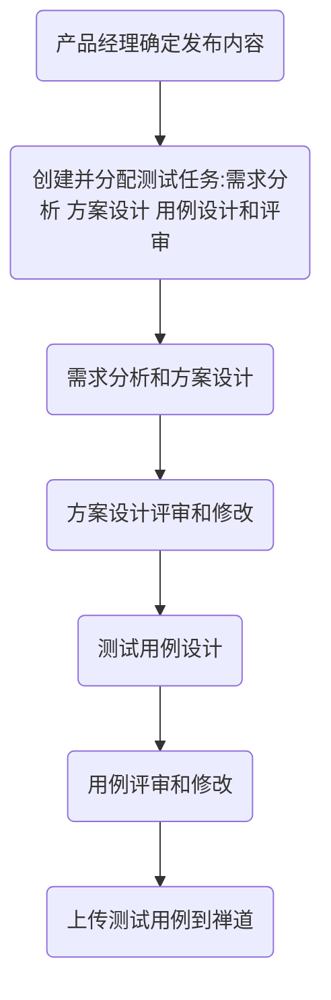
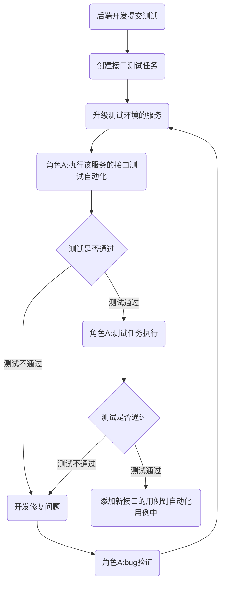
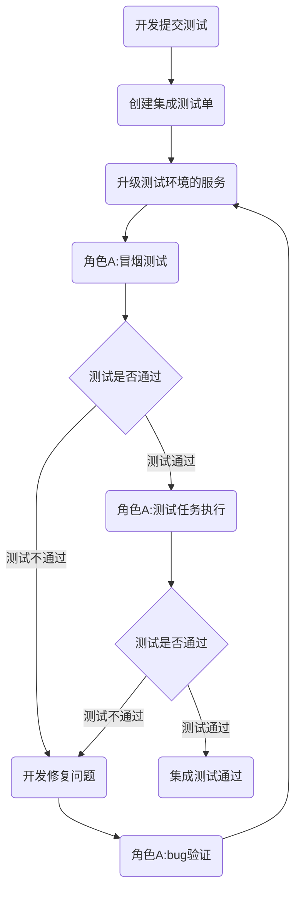
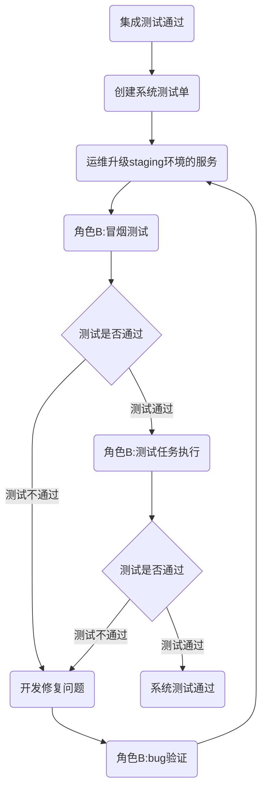
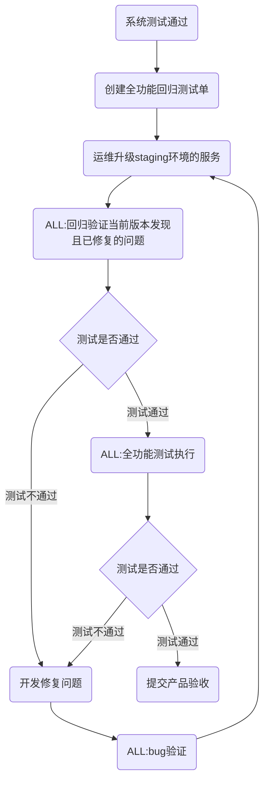

# 测试流程

## 测试准备流程

**准入条件：**产品已确定本次版本发布的需求和内容；

**执行人员：**测试全体人员；

## 测试执行流程-接口测试

**准入条件：**后端开发人员完成任务a时会提交**新的接口**，并合并代码到test分支；

**执行人员：**新街口的测试方案、测试用例的设计者A；

**执行环境：**测试环境；

**注意：创建测试任务和升级服务可以同时进行，没有先后顺序。**

**需要注意的是，接口测试和集成测试不冲突，二者之间没有从属或承接关系。**

## 测试执行流程-集成测试

**准入条件：**前、后端开发人员都完成任务a的开发，并合并代码到test分支；

**执行人员：**任务a的测试方案、测试用例的设计者A；

**执行环境：**测试环境；

**注意：创建测试单和升级服务可以同时进行，没有先后顺序。**

## 测试执行流程-系统测试流程

**准入条件：**系统测试已完成，并验证通过；

**执行人员：**执行人员B；

**执行环境：**staging环境；

**注意：创建测试单和升级服务可以同时进行，没有先后顺序。**

## 测试执行流程-全功能回归测试流程

**准入条件：**系统测试已完成，并验证通过；

**执行人员：**所有测试人员-ALL；

**执行环境：**staging环境；

**执行条件：**当要发布的内容都已测试通过后，才会执行全功能回归；

**注意：创建测试单和升级服务可以同时进行，没有先后顺序。**

## 缺陷生命周期

